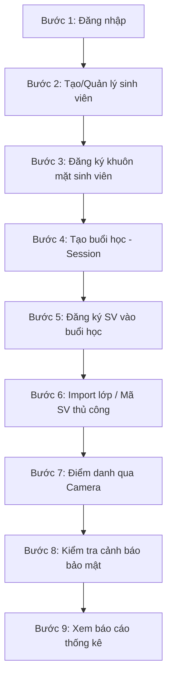

# Hướng dẫn Sử dụng Hệ thống Điểm danh Khuôn mặt (Face Attendance System)

Tài liệu này cung cấp hướng dẫn sử dụng chi tiết, dễ hiểu dành cho Giảng viên, Quản trị viên (Admin) và người dùng thử nghiệm hệ thống **Face Attendance System**. Hướng dẫn này tập trung vào các quy trình nghiệp vụ thực tế, giải thích các khái niệm cốt lõi và cách xử lý khi gặp sự cố thường gặp.

---

## 1. Giới thiệu Chung

**Face Attendance System** là hệ thống điểm danh tự động kết hợp các công nghệ hiện đại:
*   **Nhận diện khuôn mặt (Face Recognition):** Nhận dạng nhanh chóng danh tính sinh viên qua camera.
*   **Xác thực liveness chống giả mạo (Anti-Spoofing):** Phát hiện các hành vi gian lận điểm danh bằng ảnh chụp, video hoặc mặt nạ.
*   **Định vị GPS động:** Đối chiếu tọa độ thiết bị điểm danh với phòng học thực tế.
*   **Kiểm soát thời gian:** Giới hạn khung giờ điểm danh hợp lệ của buổi học.

Hệ thống được thiết kế dưới dạng **Web App/PWA (Progressive Web App) mobile-first**, cho phép mở và sử dụng mượt mà trên cả máy tính (Desktop) lẫn điện thoại di động (Mobile) thông qua trình duyệt web phổ thông.

---

## 2. Hướng dẫn Khởi chạy Hệ thống trên Máy cục bộ (Local)

Để chạy thử nghiệm toàn bộ hệ thống trên máy tính của bạn, hãy thực hiện theo các bước sau:

1.  **Chạy Cơ sở dữ liệu và Dịch vụ bổ trợ:**
    *   Mở phần mềm **Docker Desktop** trên máy tính.
    *   Mở terminal (như PowerShell hoặc Command Prompt) tại thư mục gốc của dự án và chạy lệnh:
        ```bash
        docker compose up -d
        ```

2.  **Khởi động Backend (Máy chủ xử lý):**
    *   Mở một cửa sổ terminal mới, di chuyển vào thư mục backend và chạy ứng dụng Python:
        ```bash
        cd backend
        python main.py
        ```
    *   *Trang tài liệu API tham khảo:* [http://127.0.0.1:8000/docs](http://127.0.0.1:8000/docs) (Dành cho việc kiểm tra kỹ thuật).

3.  **Khởi động Frontend (Giao diện người dùng):**
    *   Mở một cửa sổ terminal mới khác, di chuyển vào thư mục frontend và chạy máy chủ phát triển Node.js:
        ```bash
        cd frontend
        npm run dev
        ```
    *   *Link truy cập ứng dụng:* [http://localhost:5173](http://localhost:5173) (Mở bằng trình duyệt Chrome/Edge/Safari).

---

## 3. Quy trình Sử dụng Chuẩn

Để vận hành hệ thống điểm danh từ đầu đến cuối một cách trơn tru, Giảng viên/Admin hãy tuân theo quy trình **9 bước** tiêu chuẩn dưới đây:



*   **Bước 1: Đăng nhập:** Truy cập [http://localhost:5173](http://localhost:5173). Đăng nhập bằng tài khoản Quản trị viên (Admin) hoặc Giảng viên (Lecturer).
*   **Bước 2: Tạo/quản lý sinh viên:** Truy cập mục **Sinh viên (Students)** để thêm mới thông tin cơ bản của sinh viên (Họ tên, Mã sinh viên, Lớp sinh hoạt).
*   **Bước 3: Đăng ký khuôn mặt cho sinh viên:** Click vào nút đăng ký camera tại dòng thông tin sinh viên để chụp 3 ảnh chân dung từ các góc độ khác nhau. Hệ thống sẽ trích xuất dữ liệu khuôn mặt và lưu trữ.
*   **Bước 4: Tạo buổi học/session:** Truy cập mục **Buổi học (Sessions)**, chọn nút **Tạo buổi học** để thiết lập thông tin môn học, ngày dạy, khung giờ bắt đầu/kết thúc, phòng học và thông số GPS (tọa độ và bán kính điểm danh).
*   **Bước 5: Đăng ký danh sách học phần:** Tại trang danh sách buổi học, tìm buổi học tương ứng và nhấn vào nút **"Đăng ký" (Enrollments)** để quản lý những sinh viên được phép tham gia buổi học này.
*   **Bước 6: Import lớp hoặc thêm mã sinh viên thủ công:**
    *   *Import nhanh:* Nhập tên lớp sinh hoạt (ví dụ: `64-TTQL-1`) để tự động đưa toàn bộ sinh viên lớp đó vào buổi học.
    *   *Nhập thủ công:* Nhập danh sách mã sinh viên (mỗi mã một dòng), hệ thống sẽ tự động lọc bỏ các mã trùng lặp hoặc dòng trống.
*   **Bước 7: Điểm danh bằng Camera:** 
    *   Giảng viên hoặc sinh viên vào mục **Điểm danh (Attendance)**, chọn buổi học đang diễn ra, bật camera và thực hiện nhận diện.
    *   Hệ thống tự động thực hiện các bước kiểm tra liveness và GPS để ghi nhận trạng thái vào lớp/ra về.
*   **Bước 8: Xem cảnh báo bảo mật:** Tại trang **Buổi học (Sessions)**, giảng viên có thể xem trực tiếp nút **Cảnh báo (Security Alerts)** có gắn badge số lượng màu đỏ để kiểm tra các trường hợp điểm danh bất thường.
*   **Bước 9: Xem báo cáo:** Vào mục **Báo cáo (Reports)** để theo dõi tỷ lệ chuyên cần của cả lớp hoặc thống kê số lần đi muộn/vắng mặt của từng sinh viên.

---

## 4. Giải thích các Khái niệm Cốt lõi & Phân biệt

Có hai khái niệm rất dễ gây nhầm lẫn đối với người sử dụng mới:

### Phân biệt Đăng ký khuôn mặt & Đăng ký buổi học (Enrollment)

| Khái niệm | Đăng ký khuôn mặt (Face Registration) | Đăng ký buổi học (Enrollment) |
| :--- | :--- | :--- |
| **Định nghĩa** | Quá trình chụp ảnh chân dung sinh viên để lưu trữ đặc trưng khuôn mặt của họ vào cơ sở dữ liệu hệ thống. | Quá trình gán mã sinh viên vào một danh sách lớp học phần (buổi học) cụ thể. |
| **Tần suất** | Chỉ làm **1 lần duy nhất** (trừ trường hợp muốn đăng ký lại do ảnh cũ mờ/thay đổi diện mạo). | Thực hiện **cho mỗi buổi học/môn học** mới để xác định quyền điểm danh. |
| **Tác dụng** | Giúp hệ thống biết "Sinh viên này trông như thế nào". | Giúp hệ thống biết "Sinh viên này có được đi học buổi này không". |

### Điều kiện để một sinh viên điểm danh THÀNH CÔNG

Để một lượt quét khuôn mặt được hệ thống ghi nhận điểm danh chính thức mà không bị từ chối hoặc tạo cảnh báo, sinh viên cần đáp ứng **đồng thời 4 điều kiện** sau:

*   **[a] Đã đăng ký khuôn mặt:** Hệ thống nhận diện được đúng danh tính sinh viên.
*   **[b] Có tên trong danh sách đăng ký buổi học (Enrollment):** Sinh viên phải có trạng thái enrollment `active` trong buổi học đó.
*   **[c] Nằm trong cửa sổ thời gian cho phép:** Quá trình quét diễn ra từ 5 phút trước giờ học tới tối đa 10 phút sau giờ bắt đầu (Ví dụ: học lúc 7:00 thì được quét từ 6:55 đến 7:10).
*   **[d] GPS hợp lệ:** Thiết bị thực hiện điểm danh phải ở trong bán kính cho phép của phòng học (lấy từ dữ liệu vị trí GPS của phòng học tĩnh hoặc buổi học động).

---

## 5. Phân loại và Giải thích Dữ liệu Sinh viên

Hệ thống quản lý dữ liệu sinh viên dựa trên các nhóm nguồn dữ liệu sau:

1.  **Sinh viên thật (Real Students):**
    *   Là sinh viên thực tế của trường, được nhập thông tin chính xác và đăng ký khuôn mặt trực tiếp bằng camera. 
    *   **Đây là nhóm duy nhất được hệ thống chấp nhận ghi nhận điểm danh chính thức.**
2.  **Dữ liệu đánh giá (LFW / Kaggle / Evaluation Data):**
    *   Là dữ liệu ảnh chân dung từ các tập dữ liệu mở nổi tiếng (như Labeled Faces in the Wild - LFW) được nạp vào hệ thống phục vụ mục đích kiểm thử độ chính xác của mô hình AI học máy.
    *   > [!IMPORTANT]
    *   > Dữ liệu LFW/Kaggle chỉ dùng để test mô hình nhận diện trong mục "Kiểm thử mô hình". **Hoàn toàn không được ghi nhận điểm danh chính thức** khi đưa vào camera điểm danh thực tế.
3.  **Dữ liệu Demo / MVP:**
    *   Dữ liệu giả lập sinh viên được tạo sẵn để thực hiện demo nhanh các chức năng của hệ thống mà không cần thiết lập thủ công từ đầu.

---

## 6. Giải thích các Cảnh báo Bảo mật (Security Alerts)

Khi có sinh viên thực hiện quét khuôn mặt, nếu vi phạm chính sách an toàn, hệ thống sẽ chặn điểm danh đồng thời tạo một bản ghi cảnh báo gửi tới giảng viên. Dưới đây là các loại cảnh báo:

*   **SPOOF (Giả mạo khuôn mặt - Màu đỏ 🚨):**
    *   *Nguyên nhân:* Sinh viên cố tình gian lận bằng cách đưa ảnh chụp điện thoại khác, ảnh in trên giấy, hoặc video chân dung trước camera.
    *   *Hệ quả:* Chặn điểm danh ngay lập tức, hiển thị thông báo đỏ trên màn hình camera.
*   **UNKNOWN_FACE (Khuôn mặt không xác định - Màu đỏ ❓):**
    *   *Nguyên nhân:* Người đứng trước camera chưa từng được đăng ký khuôn mặt trên hệ thống hoặc độ tin cậy nhận diện quá thấp (< 0.60).
*   **NOT_ENROLLED (Không thuộc danh sách buổi học - Màu cam ⚠️):**
    *   *Nguyên nhân:* Hệ thống nhận dạng đúng sinh viên thật, nhưng sinh viên này không có tên trong danh sách đăng ký buổi học hiện tại (không học lớp này).
*   **LATE_ENTRY (Quét ngoài khung giờ - Màu vàng ⏳):**
    *   *Nguyên nhân:* Sinh viên thực hiện quét nhận diện quá sớm (trước hơn 5 phút) hoặc quá muộn (sau khi buổi học bắt đầu hơn 10 phút).
*   **insufficient_enrollments (Thiếu số lượng đăng ký tối thiểu - Màu vàng 👥):**
    *   *Nguyên nhân:* Buổi học được tổ chức nhưng danh sách đăng ký học phần lại chứa ít hơn 5 sinh viên (không đủ điều kiện tổ chức lớp học an toàn theo quy định hệ thống).

---

## 7. Hướng dẫn Demo Nhanh dành cho Giảng viên (Checklist)

Nếu bạn cần giới thiệu nhanh các tính năng cốt lõi của hệ thống cho các bên liên quan, hãy làm theo các bước chuẩn bị và chạy demo sau:

### Chuẩn bị dữ liệu
- [ ] Khởi chạy thành công Docker, Backend và Frontend.
- [ ] Truy cập mục **Sinh viên (Students)**, tạo nhanh 5 sinh viên demo mới (ví dụ: `SV001` đến `SV005`).
- [ ] Chọn 1 sinh viên trong số đó (ví dụ: `SV001`), nhấn nút camera để đăng ký khuôn mặt thật của bạn cho mã sinh viên này.
- [ ] Truy cập mục **Buổi học (Sessions)**, bấm tạo mới 1 buổi học với thời gian bắt đầu trùng với khung giờ hiện tại của máy tính để đảm bảo nằm trong cửa sổ điểm danh.
- [ ] Nhấn nút **"Đăng ký"** tại buổi học vừa tạo. Gõ tên lớp học hoặc thêm thủ công danh sách mã sinh viên `SV001, SV002, SV003, SV004, SV005` vào buổi học. Nhấn Lưu.

### Trình diễn điểm danh
- [ ] Đi tới mục **Điểm danh (Attendance)**, chọn buổi học bạn vừa thiết lập.
- [ ] Bấm nút **"Bật camera"**. Đưa khuôn mặt của bạn vào khung hình và bấm **"Nhận diện"**.
- [ ] Hệ thống nhận dạng chính xác khuôn mặt bạn (được gán với `SV001`) và thông báo **Điểm danh thành công** (màu xanh lá).
- [ ] *Test cảnh báo Spoof:* Dùng điện thoại chụp lại mặt bạn, sau đó đưa ảnh chụp đó trước camera điểm danh và bấm quét. Hệ thống sẽ ngay lập tức hiện Toast đỏ cảnh báo **"Phát hiện giả mạo khuôn mặt"**.
- [ ] *Test kiểm tra bảo mật:* Quay lại danh sách **Buổi học (Sessions)**, nhấn nút **"Cảnh báo"** trên dòng buổi học để xem danh sách log chi tiết các lượt vi phạm (trong đó có lượt spoof vừa thực hiện, đi kèm ảnh chụp camera thực tế lúc vi phạm để giảng viên đối chứng).

---

## 8. Lỗi Thường gặp & Cách khắc phục

*   **Lỗi: Giao diện hiển thị "Không thể kết nối đến máy chủ"**
    *   *Khắc phục:* Kiểm tra xem Docker Desktop đã chạy chưa, sau đó xác nhận cửa sổ terminal chạy Python backend (`python main.py`) vẫn đang hoạt động và không có thông báo crash.
*   **Lỗi: Camera không thể bật hoặc màn hình camera đen xì**
    *   *Khắc phục:* Trình duyệt web chưa được cấp quyền truy cập camera. Hãy nhấn vào biểu tượng ổ khóa ở bên trái thanh địa chỉ trình duyệt và bật quyền cấp phép sử dụng "Camera".
*   **Lỗi: Không thể điểm danh do "Thiếu dữ liệu định vị GPS" hoặc "Không lấy được vị trí"**
    *   *Khắc phục:* Đảm bảo thiết bị của bạn đã bật định vị (Location Services) và trình duyệt đã được cho phép truy cập tọa độ GPS.
*   **Lỗi: Điểm danh báo lỗi "Ngoài cửa sổ điểm danh"**
    *   *Khắc phục:* Khung giờ bạn thực hiện quét nằm ngoài khoảng cho phép (sớm hơn 5 phút hoặc muộn hơn 10 phút so với giờ bắt đầu). Giảng viên có thể điều chỉnh lại thời gian bắt đầu của buổi học trên giao diện để test thử.
*   **Lỗi: Nhận diện thành công nhưng báo "Chưa đăng ký buổi học"**
    *   *Khắc phục:* Sinh viên này chưa được thêm vào danh sách đăng ký học phần (Enrollment) của buổi học hiện tại. Hãy nhấn nút "Đăng ký" tại màn hình Sessions để bổ sung mã sinh viên của họ vào.

---

## 9. Ghi chú Triển khai Thực tế (Deployment Notes)

*   **Hiện trạng ứng dụng:** Phiên bản hiện tại là Web App/PWA chạy trên nền tảng trình duyệt web, tối ưu hóa hiển thị cho thiết bị di động, chưa phải ứng dụng di động gốc (Native App) tải từ CH Play hoặc App Store.
*   **Cách demo giả lập điện thoại:** Bạn có thể mở ứng dụng trên máy tính Chrome, nhấn phím `F12` (mở công cụ Developer Tools) rồi click vào biểu tượng thiết bị di động (Toggle device toolbar) để trải nghiệm giao diện mobile-first trực quan.
*   **Yêu cầu môi trường chạy thực tế:** Để sử dụng các tính năng phần cứng như Camera và định vị GPS trên điện thoại di động thật, máy chủ deploy bắt buộc phải cấu hình giao thức bảo mật **HTTPS** (Trình duyệt web di động sẽ tự động chặn Camera và GPS nếu chạy trên giao thức HTTP không bảo mật).
